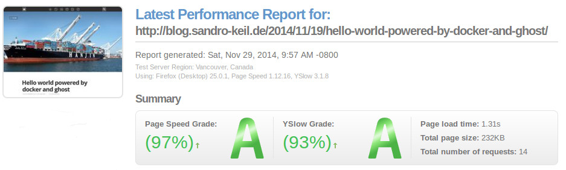

# Casperion Ghost theme

> Full text search

> Disqus comments

> Highlight.js integration

> Google analytics

> Top pinned navigation bar and off-canvas menu

> Minified css and js

**Casperion** is a free Ghost theme powered by SASS. The theme is based upon original Ghost theme [Casper](https://github.com/TryGhost/Casper)
with some minor modifications and extensions.

## [Casperion Demo](http://blog.sandro-keil.de/)

Casperion is a lightweight and speed optimized theme for Ghost. Casperion theme gets Grade A for both PageSpeed and
YSlow reported by [GTmetrix](http://gtmetrix.com/reports/blog.sandro-keil.de/o98VUD7).

## Full Features

**Casperion** theme is packaged with full powerful features so you can get started building your blog easily.
It's planned to update this theme consistently depending on Casper theme changes.

### Full Ghost 0.5.6 support
Casperion supports latest Ghost version.

### Top pinned navigation bar and off-canvas menu
The top navigation menu bar contains the off-canvas menu button, social media icons and the search button.

### Additional meta tags
Casperion uses additional meta tags for google webmaster tools and twitter.

### GhostHunter
[GhostHunter](https://github.com/i11ume/GhostHunter/) provides Casperion full text searching right in the blog without
having to resort to any third-party solutions, by utilizing the rss feed.

### Google Fonts
[Google Fonts](http://www.google.com/fonts) offers hundreds of free, open-source fonts optimized for the web. Just one
quick step on changing Casperion configuration file and you are ready to have Google Font presented on your blog.

### Google Analytics
Casperion uses the asynchronous [Google Analytics](http://www.google.com/analytics/) tracking code, the fastest and most
reliable tracking code Google Analytics offers.

### FitVids.JS
A lightweight, easy-to-use jQuery plugin for fluid width video embeds, to achieve fluid width videos in your responsive
blog. [FitVids.JS](http://fitvidsjs.com/) support YouTube, Vimeo, Blip.tv, Viddler, Kickstarter, and even your own video vendor.

### Disqus
[Disqus](http://disqus.com/) makes commenting easier and more interactive, while connecting your blog and your
commenters across a thriving discussion community. The Disqus widget for Casperion seamlessly integrates with your blog
post using the Disqus API and is only loaded if the user want it.

### Highlight.JS
[Highlight.js](http://highlightjs.org/) highlights syntax in code examples on Casperion blog. It's very easy to use
because it works automatically: finds blocks of code, detects a language, highlights it. Highlight.js is only loaded if
a code block was detected in blog post.

### Gulp.JS
[Gulp](http://gulpjs.com/) is an intuitive, code-over-configuration, streaming build system. We use Gulp to build
Casperion theme package and all its related files.

## Development
Don't make any changes in assets folder. Only use src folder and use `gulp watch` to automatically update assets on changes.

### Change to your needs
Please have a look at the following files to configure this theme to your needs.

* default.hbs
* files under partials/all

### SASS files
The original Casper Theme CSS has split in several SASS files.

### TODO
:white_medium_square: Use more configuration variables
:white_medium_square: Use more SASS variables
:white_medium_square: Optimize own added CSS
:white_medium_square: Optimize own added JS

## Copyright & License

Copyright (c) 2013-2014 Ghost Foundation - Released under the MIT License.

Permission is hereby granted, free of charge, to any person obtaining a copy of this software and associated documentation files (the "Software"), to deal in the Software without restriction, including without limitation the rights to use, copy, modify, merge, publish, distribute, sublicense, and/or sell copies of the Software, and to permit persons to whom the Software is furnished to do so, subject to the following conditions:

The above copyright notice and this permission notice shall be included in all copies or substantial portions of the Software.

THE SOFTWARE IS PROVIDED "AS IS", WITHOUT WARRANTY OF ANY KIND, EXPRESS OR IMPLIED, INCLUDING BUT NOT LIMITED TO THE WARRANTIES OF MERCHANTABILITY, FITNESS FOR A PARTICULAR PURPOSE AND
NONINFRINGEMENT. IN NO EVENT SHALL THE AUTHORS OR COPYRIGHT HOLDERS BE LIABLE FOR ANY CLAIM, DAMAGES OR OTHER LIABILITY, WHETHER IN AN ACTION OF CONTRACT, TORT OR OTHERWISE, ARISING FROM, OUT OF OR IN CONNECTION WITH THE SOFTWARE OR THE USE OR OTHER DEALINGS IN THE SOFTWARE.
